<p align="center">
  
</p>


<p align="center">
  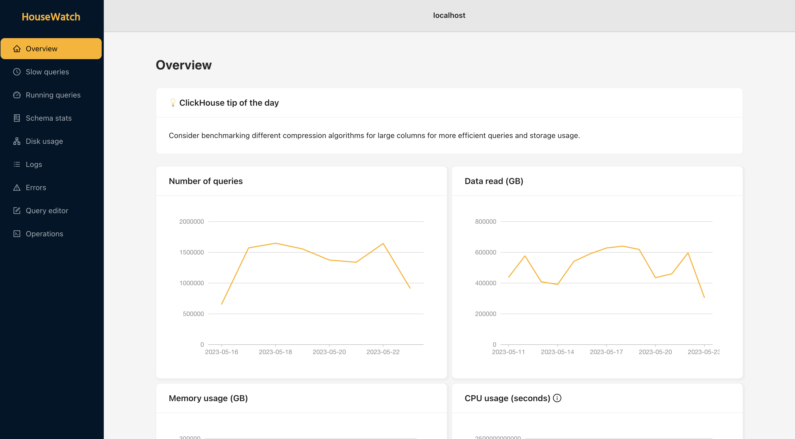
</p>


## 📈 Open source tool for monitoring and managing ClickHouse clusters

- Get an overview of cluster load and performance
- Drill down into your queries and understand the load they put on your cluster
- Search through logs and errors
- Monitor and kill running queries with the click of a button
- Get stats on your disk usage per node, and understand how much disk space tables, columns, and parts take up
- Run your own queries straight from the interface to further dig into performance and cluster issues
- Setup operations to run in the background with automatic rollbacks for failures

## 💻 Deploy

To deploy HouseWatch, clone this repo and then run the following, substituting the environment variables for the relevant values of one of your ClickHouse instances:

```bash
CLICKHOUSE_HOST=localhost \
CLICKHOUSE_CLUSTER=mycluster \
CLICKHOUSE_USER=default \
CLICKHOUSE_PASSWORD=xxxxxxxxxxx \
docker compose -f docker-compose.yml up
```

<details>

<summary>Read more</summary>

<br />

The following are the supported environment variables for configuring your HouseWatch deployment:

- `CLICKHOUSE_HOST`: Required - hostname of the instance to connect to.
- `CLICKHOUSE_USER`: Required - username to access ClickHouse. Can be a read-only user, but in that case not all features will work.
- `CLICKHOUSE_PASSWORD`: Required - password for the specified user.
- `CLICKHOUSE_DATABASE`: Optional - database to connect to by default.
- `CLICKHOUSE_CLUSTER`: Optional - cluster name, to analyze data from the whole cluster.
- `CLICKHOUSE_SECURE`: Optional - see [clickhouse-driver docs](https://clickhouse-driver.readthedocs.io/en/latest/index.html) for more information
- `CLICKHOUSE_VERIFY`: Optional - see [clickhouse-driver docs](https://clickhouse-driver.readthedocs.io/en/latest/index.html) for more information
- `CLICKHOUSE_CA`: Optional - see [clickhouse-driver docs](https://clickhouse-driver.readthedocs.io/en/latest/index.html) for more information

</details>

## 💡 Motivation

At PostHog we manage a few large ClickHouse clusters and found ourselves in need of a tool to monitor and manage these more easily. 

ClickHouse is fantastic at introspection, providing a lot of metadata about the system in its system tables so that it can be easily queried. However, knowing exactly how to query and parse the available information can be a difficult task. Over the years at PostHog, we've developed great intuition for how to debug ClickHouse issues using ClickHouse, and HouseWatch is the compilation of this knowledge into a tool.

Beyond monitoring, we also built internal systems and processes for managing the clusters that spanned various platforms. We would use Grafana to look at metrics, SSH into nodes for running operations and using specialized tooling, query via Metabase to dig deeper into the data in the system tables and create dashboards, and then a combination of tools baked into the PostHog product for further debugging and streamlined operations such as our [async migrations](https://posthog.com/blog/async-migrations) tool, and internal views for listing queries and analyzing their performance.

As a result, we felt it was appropriate to have these tools live in one place. Ultimately, our vision for HouseWatch is that it can both serve the purpose of a pganalyze for the ClickHouse ecosystem, while also including tooling for taking action on insights derived from the analysis.

## 🏗️ Status of the project

HouseWatch is in its early days and we have a lot more features in mind that we'd like to build into it going forward. The code could also use some cleaning up :) As of right now, it is considered Beta software and you should exercise caution when using it in production. 

One potential approach is to connect HouseWatch to ClickHouse using a read-only user. In this case, the cluster management features will not work (e.g. operations, query editor), but the analysis toolset will function normally.


## ℹ️ Contributing

Contributions are certainly welcome! However, if you'd like to build a new feature, please open up an issue first.

## ⭐ Features

<h2 align="center">Query performance</h3>

<div style="display: flex">
  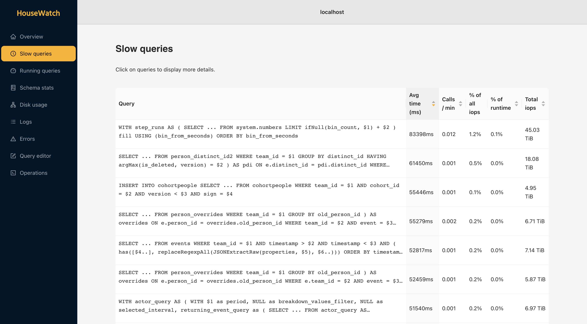
  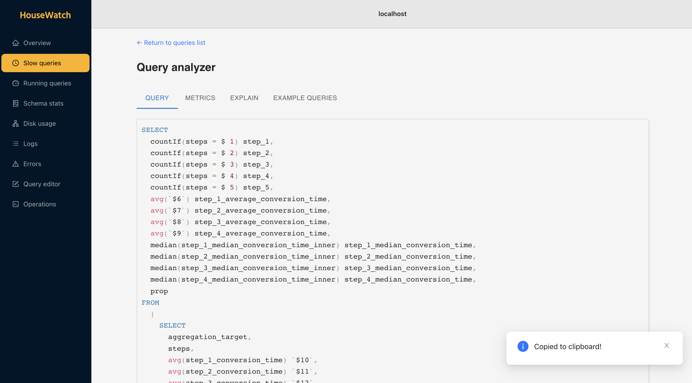
</div>

<div style="display: flex">
  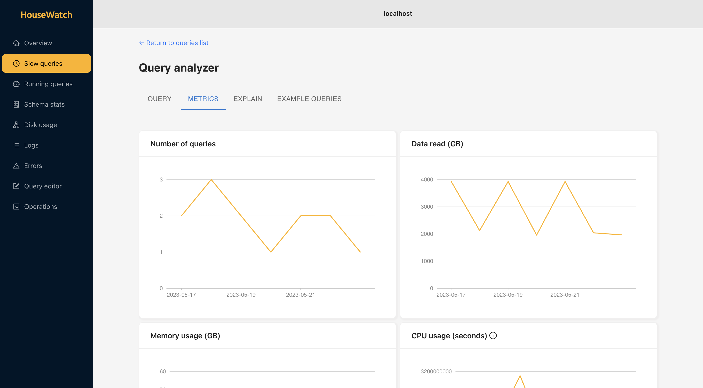
  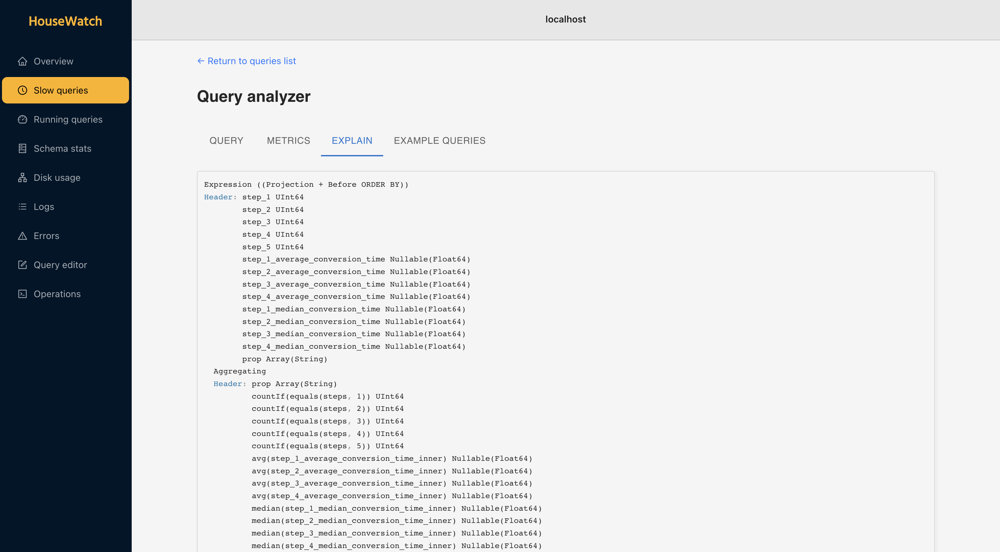
</div>

<h2 align="center">Schema stats</h3>

<div style="display: flex">
  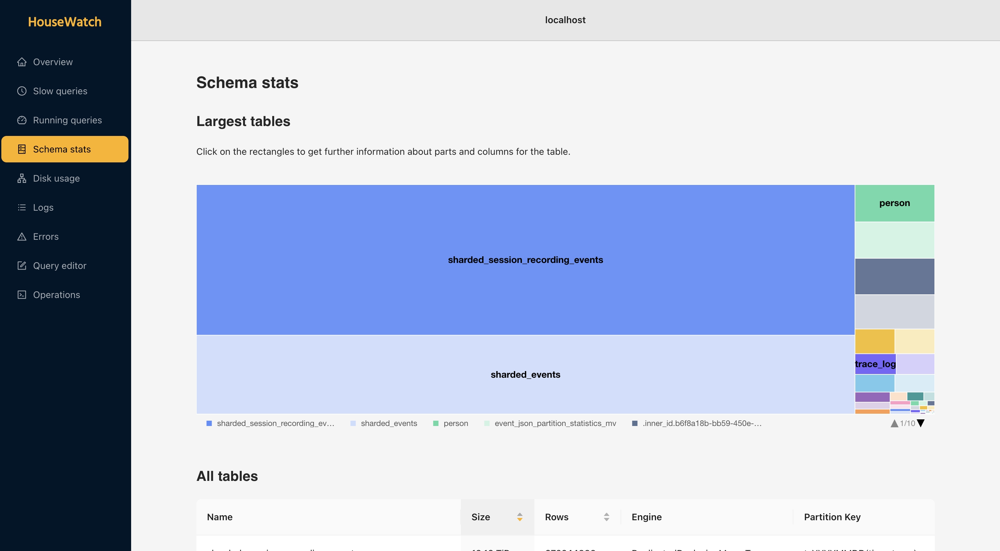
  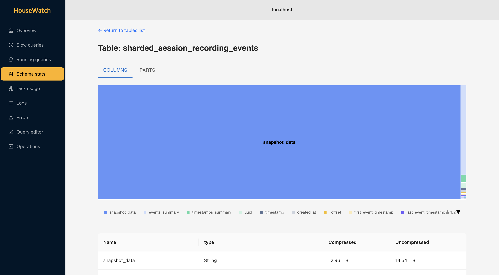
</div>

<h2 align="center">Logs</h3>

<p align="center">
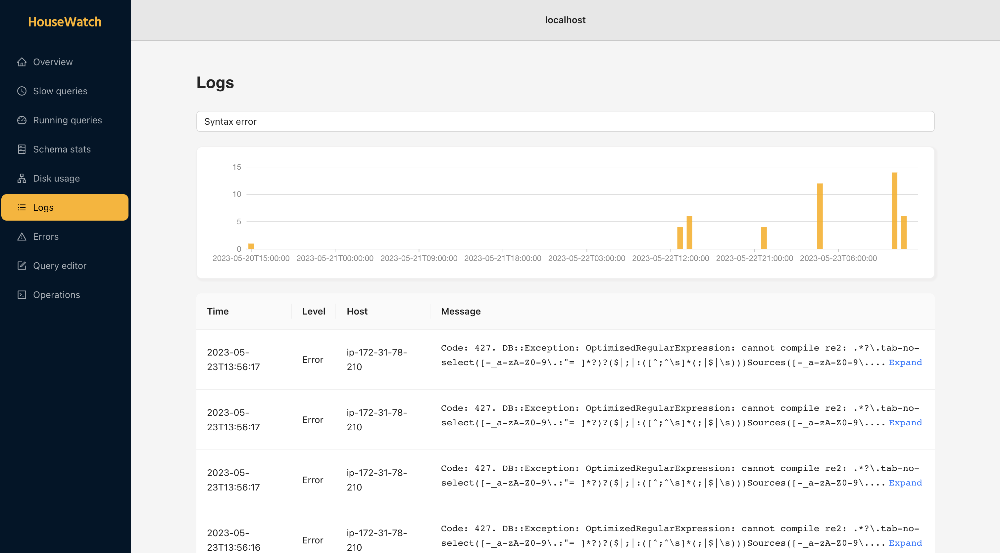
</p>

<h2 align="center">Query editor</h3>

<p align="center">
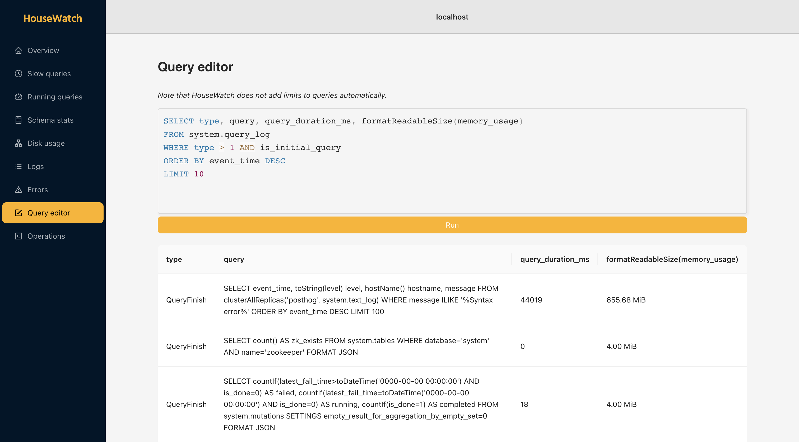
</p>

<h2 align="center">Disk usage</h3>

<p align="center">
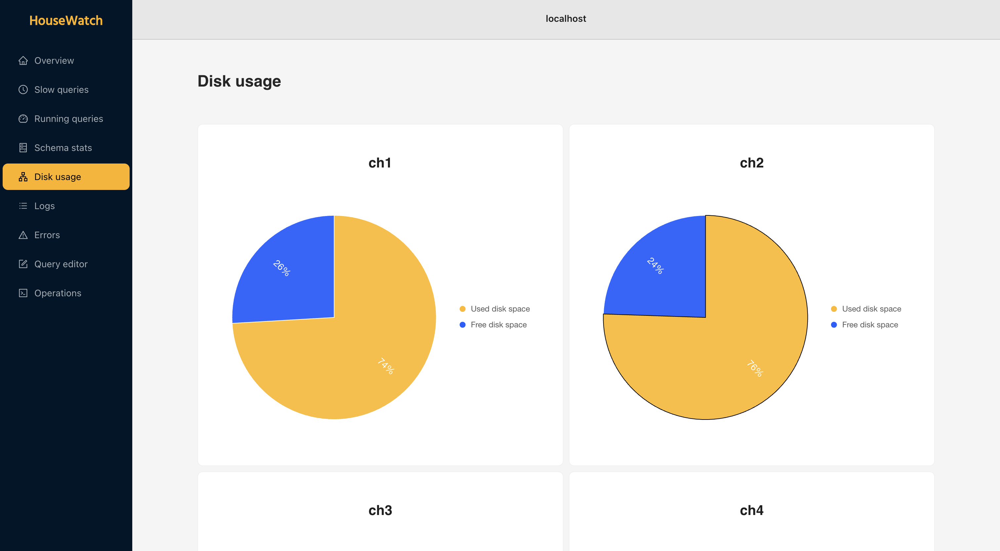
</p>

<h2 align="center">Errors</h3>

<p align="center">
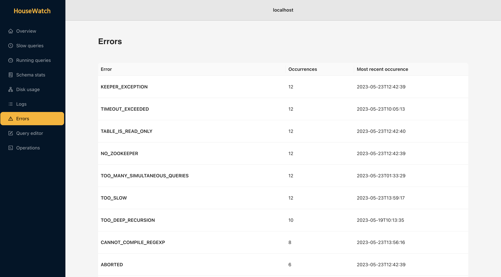
</p>


## 🗒️ To-do list

A public list of things we intend to do with HouseWatch in the near future.

<details>

<summary>See list</summary>

<br />

<b>Features</b>

- [ ] System issues tab
- [ ] EXPLAIN visualizer
- [ ] Multiple instance support
- [ ] Cache queries
- [ ] Stats on page cache hit percentage
- [ ] Make operations resilient to Celery going down (as we do in PostHog with async migrations)
- [ ] Read-only mode
- [ ] Button to force refresh running queries list
- [ ] Logs pagination
- [ ] Allow copying example queries
- [ ] Configurable time ranges
- [ ] Whole cluster schema stats
- [ ] Kill queries on query editor


<b>Developer experience</b>

- [ ] Configure instance from UI
- [ ] Publish a Docker image

<b>Cleanup</b>

- [ ] Extract README images out of repo 
- [ ] Make banner subtitle work on dark mode
- [ ] Handle cluster being undefined
- [ ] Standardize everything to use async/await syntax
- [ ] Fetch data independently on the query analyzer
- [ ] Get rid of remaining Material UI components
- [ ] Breakpoint for logs search
- [ ] Run Django "production server"
- [ ] Write tests :)
- [ ] Query editor pipe all errors to client
- [ ] Clear polling when user navigates to another page 

</details>